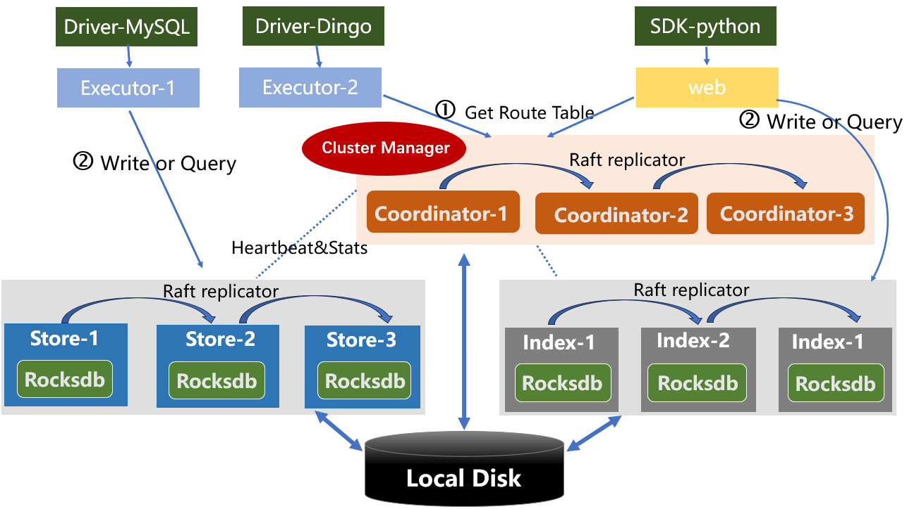

# Deployment of DingoDB
[DingoDB](https://github.com/dingodb/dingo) is a distributed multi-modal vector database that combines the characteristics of data lakes and vector databases and can store data of any type and size (Key-Value, PDF, audio, video, etc.). It has real-time low-latency processing capabilities, enables rapid insight and response, and can efficiently perform instant analysis and process multi-modal data.
In order to simplify the deployment, this project introduces the deployment of DingoDB using [ansible](https://www.ansible.com/).

## 1. Cluster Mode

----



The roles in the cluster are mainly divided into:

- Coordinator

Coordinator act as the master of the cluster. It is responsible for the management and scheduler of data replications of DingoDB cluster.

- Store
  
Store act as the storage of the cluster,  It is responsible for managing the entire storage.

- Index
  
Index is a specialized version of Dingo-Store. It not only offers distributed data storage capabilities but also ensures real-time construction of high-dimensional vector data and its indexing. It provides extensive search capabilities in high-dimensional spaces. The system supports vector index formats such as HNSW and IVF.

- Executor

Executor act as the worker of the cluster. It is responsible for executing the physical execution plan of  SQL to scan and compute the data.

- Proxy

Proxy provides a bridge for index operations, and provides http and grpc interfaces for use by pythonSDK

- Driver-MySQL/Driver-DIngo

DingoDB uses JDBC driver to perform table-level data operations, such as create, insert, update, delete, etc. Driver Proxy act as the proxy of JDBC Connection.
### 1.1 Installation prerequisites

- Version of OS

CentOS 8.x.

- Repository of Yum works fine

The repository will be used to install basic tools needed by the cluster, such as `python3`.

- Ansible Host

A host installed with `ansible` is required to  distribute cluster configuration and related software modules about DingoDB. This machine can also be replaced by one node in DingoDB cluster such as `Store-1` or `Coordinator-1`.

### 1.2 Deployment Guidelines

In the cluster mode, `ansible` is selected as the deployment tools. You can use this guide to install a DingoDB cluster.


### 1.2.1 Install Steps

You can follow this guide to install a dingo cluster:

[](https://asciinema.org/a/QGKWzvTp4b2nt8pmdjauDewIh)

### 1.2.2 Installation Notes

#### 1. define cluster configuration

Edit the configuration `inventory/hosts`, use the real host, user, password to replace the item.

```cfg
[all:vars]
ansible_connection=ssh
#ansible_ssh_user=root
#ansible_ssh_pass=datacanvas@123
ansible_python_interpreter=/usr/bin/python3

[scaling_in_dingo:children]
add_coordinator
add_store

[coordinator]
172.20.3.201 
172.20.3.200
172.20.3.202

[store]
# 172.20.3.201
# 172.20.3.201 store_num=2 
# 172.20.3.201 store_num=2 disk='/home/sd1 /home/sd2'
172.20.3.201
172.20.3.200 
172.20.3.202

[index]
# 172.20.3.201 index_num=2 disk='/home/sd1 /home/sd2'
172.20.3.201
172.20.3.200 
172.20.3.202

[all_nodes:children]
coordinator
store
index

[executor]
172.20.3.201
172.20.3.200
172.20.3.202

[proxy]
172.20.3.201

[executor_nodes:children]
executor
proxy

```

#### 2. Check Python3 is installed

Check Python3 is installed or not on DingoDB cluster, if `Python3` is not installed, We can use ansible to install `Python3` using such command.

```shell
ansible all_nodes --become -m raw -a "yum install -y python3" -i ansible_hosts
```

#### 3. Start to install

- Copy artifacts

```
1. artifacts/jdk-8u171-linux-x64.tar.gz
2. artifacts/dingo.zip
3. artifacts/dingo-store.tar.gz
```

- merge dingo.zip and dingo-store.tar.gz to dingo.tar.gz

```shell
 cd artifacts
 bash merge_dingo.sh
```

- check whether there are ports in use in the nodes, and if so, modify the port configuration in Configuration `group_vars/all/_shared.yml`

```shell
ansible-playbook playbooks/02_1_check_ports.yml -e "check_port_conflicts=true" 
```

- Executor ansible script

```shell
 ansible-playbook playbook.yml
```

## 2. Docker compose mode

----

> Due to the network firewall, for the convenience of developers, DingoDB team no longer provide a unified GitHub docker repository.

### 2.1 Installation prerequisites

- docker
- docker-compose

### 2.2 Install Steps

[](https://asciinema.org/a/Wif9vRWXLnAvDkemXMuyShx5H)